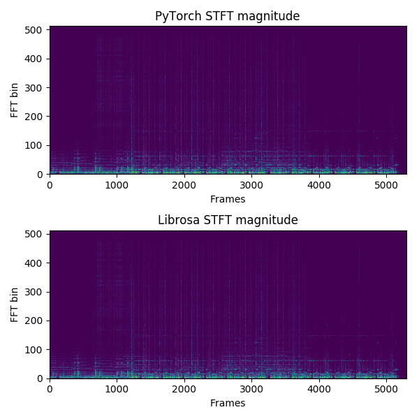

[](https://travis-ci.com/pseeth/torch-stft)

# STFT/iSTFT in PyTorch

Author: [Prem Seetharaman](http://pseeth.github.io)

An STFT/iSTFT written up in PyTorch using 1D Convolutions. Requirements are a recent version PyTorch, numpy, and librosa (for loading audio in test_stft.py). Thanks to Shrikant Venkataramani for sharing code this was based off of and Rafael Valle for catching bugs and adding the proper windowing logic. Uses Python 3.

## Installation
Install easily with pip:
```
pip install torch-stft
```

## Usage
```
import torch
from torch_stft import STFT
import numpy as np
import librosa 
import matplotlib.pyplot as plt

audio = librosa.load(librosa.util.example_audio_file(), duration=10.0, offset=30)[0]
device = 'cpu'
filter_length = 1024
hop_length = 256
win_length = 1024 # doesn't need to be specified. if not specified, it's the same as filter_length
window = 'hann'

audio = torch.FloatTensor(audio)
audio = audio.unsqueeze(0)
audio = audio.to(device)

stft = STFT(
    filter_length=filter_length, 
    hop_length=hop_length, 
    win_length=win_length,
    window=window
).to(device)

magnitude, phase = stft.transform(audio)
output = stft.inverse(magnitude, phase)
output = output.cpu().data.numpy()[..., :]
audio = audio.cpu().data.numpy()[..., :]
print(np.mean((output - audio) ** 2)) # on order of 1e-16
```

Output of [`compare_stft.py`](compare_stft.py):



## Tests
Test it by just cloning this repo and running
    
```
pip install -r requirements.txt
python -m pytest .
```

Unfortunately, since it's implemented with 1D Convolutions, some filter_length/hop_length 
combinations can result in out of memory errors on your GPU when run on sufficiently large input.


## Contributing
Pull requests welcome.

